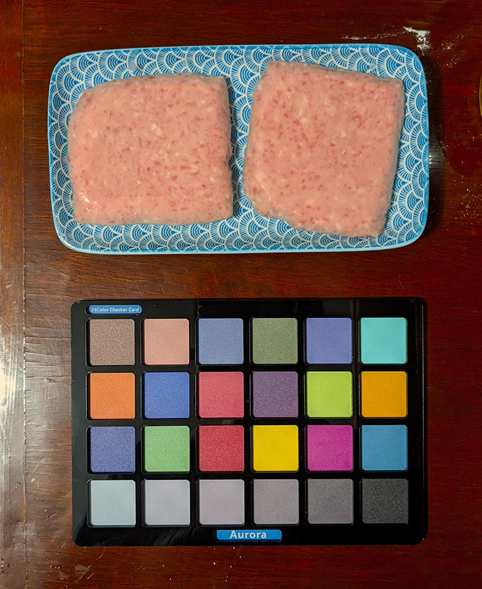
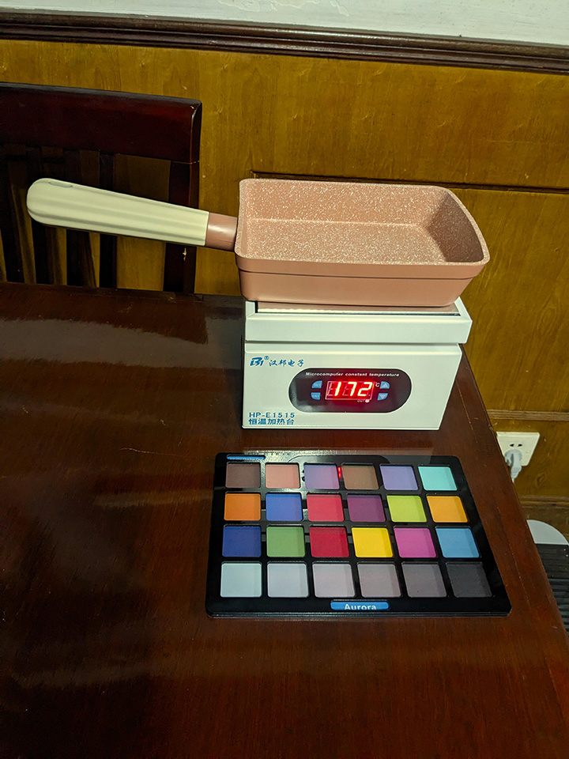
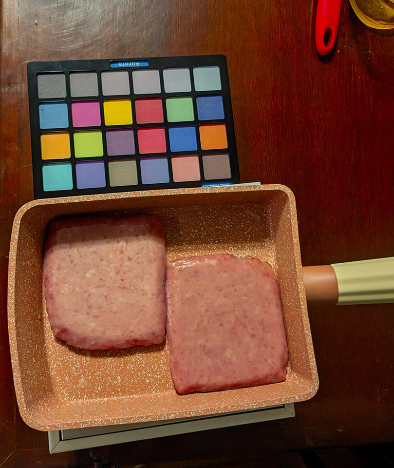
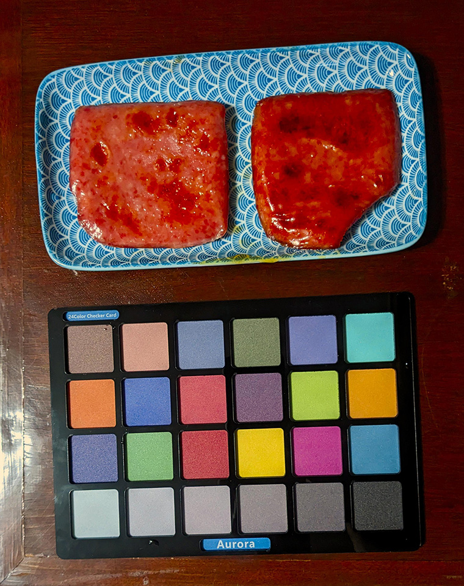

# 莉沫酱小厨房

大家平时做饭的时候会看菜谱吗？

网上的菜谱都是1些很奇怪的东西，它们既不是给机器看的也不是给人看的——之所以说它不是给人看的，是因为那些菜谱从来都只说步骤，不说原理，那这样实际上是把人变成了实现菜的机器，而不是让人学会了做菜。

此外，菜谱还有1些问题。比如它没有异常处理，假如我做到第4步，发现第2步忘记做了，我是回到第2步重做第2、3、4步，还是做完第4步以后再做第2步，还是直接把菜倒掉？

所以我决定了，我要出道成为料理界的明星，让这些凡夫俗子见识1下莉沫酱究极料理的厉害！


## 规则

因为《莉沫酱小厨房》好料理书，所以要遵守以下规则:

1. 先说理论，再说做法。

2. 操作时尽可能给出准确的操作法和参数。

3. 参数需要给出理由，如果没有，需要显式注明这个参数是不可靠的。

4. 尽可能使用标准的原材料和工具。

5. 各个步骤都需要给出经过颜色校准的图片。


## 目录

1. 如何烤肉

2. 如何烤肉2 (还没写)

3. 如何煎蛋 (还没写)

4. 接下来做什么呢…… (还没写)


## 如何烤肉

事情是这样的，我之前买了很多肉罐头，用作战备粮食，但是看起来今年不会打仗了，就想着，那吃掉1点吧。

但是肉罐头的肉不是很好吃！罐头的肉只是简单地被煮熟了而已，还不能称得上美食，所以我要把它做成烤肉！

烤肉的味道主要来自于烤的时候发生的梅纳反应，在这个反应中，还原糖和蛋白质会反应生成1些褐色的风味物质，它们是烤肉独特香味的来源。换句话说，学会了梅纳反应，就学会了烤肉！


### 准备原料

- 世棒午餐肉(单片装)

这里选用单片装是因为可以不用切，它的厚度和重量是固定的，避免因为切得太厚或者太薄导致结果不1致。

- 葡萄糖

根据wikipedia的介绍，梅纳反应应该要用醛糖。果糖似乎在溶液中也能变成醛糖，但是我也不知道它实际效果好不好，所以还是用葡萄糖吧。

以及葡萄糖比蔗糖小1些，所以它应该能使腌制变得更容易……这点我不确定，它的极性看起来也更大。此外，葡萄糖不如果糖和蔗糖甜，即使反应完还剩1点也不会让肉变得很甜。

- 水

我用的是纯净水，但是应该普通的水就可以了。


### 实验步骤

#### 腌制午餐肉

首先，我们先用饱和葡萄糖水把午餐肉腌1腌。

之所以要腌，而不是涂抹上去烤，是因为我觉得腌制能使葡萄糖分子扩散到肉中，使反应物预先混合——但是这件事是没有充分验证的，有可能腌制其实没有效果，只是腌完之后从糖水里带出来的水膜起了作用。

此外，葡萄糖的溶解度很高。我上网查了1下，在20摄氏度的水中的溶解度有人说83g，有人说110g，我猜可能有些人的数据里的葡萄糖带带结晶水吧，总之配饱和溶液的时候就直接加到溶解不动为止就好了。

这个时候需要给肉拍1张照片，用于最后1步的检验。不拍也可以，但是检验误差会变大。

然后把2块午餐肉放进去，因为溶液密度太大了午餐肉会浮起来……之所以刚开始用了饱和溶液，是因为我觉得浓度差越大扩散越快，但是浮起来也是个问题，下次要计算1下溶解的量，让肉刚好沉下去。

因为渗透压太高了，细菌无法在这个糖水里生存，所以不放冰箱应该也可以。腌制的时间我也说不准，我是等了30分钟，这个数值就是凭感觉来的。




#### 热锅

嗯，热锅很重要呢，不能太热也不能太冷！

关于梅纳反应需要的温度，wikipedia上说的是140~170℃，但是DK百科上说的是110~115℃。但是wikipedia的这个数据来自于1个奇怪的菜谱网站，我觉得这不可靠，DK百科……嗯，虽然没有标来源，但至少它是正规出版物，那就110~115℃好了。

接下来把锅放在加热装置上，用红外线测温枪测试锅内的温度，同时调整加热装置的参数，使锅在没有东西的时候，温度恰好能稳定在110~115℃的范围内。

此外，如果你用的是电磁炉，可能会发现锅的温度不是均匀的(这是感应加热的特性)，那可以自己改进1下这个标准。

图片上的数值是我为了让他升温快1点偷偷调大的。




#### 烤肉

直接把肉放进锅里就可以了。

接下来用红外线测温枪测试测试锅内未被肉覆盖处的位置，它们应当继续保持在110~115℃的范围内，否则你就需要调参数了。

每过1小段时间就把肉翻1个面，观察肉褐化的情况。建议时间间隔是30秒，理论上更长也没有问题，30秒是我凭感觉编的。因为金属键导热很快，肉底面的温度和锅内未被肉覆盖处的温度应该是1样的，只要达不到肉烧焦的温度(DK百科里写的是130~140℃)它就不会烧焦。

烤到两面都是褐色之后，就把肉从锅里铲出来吧。至于什么是褐色我也不知道，因为我是色盲……这个步骤还需要改进，可以考虑1边做、1边用摄像头采样看肉的颜色！




#### 验证

把肉从锅里铲出来之后，需要验证1下肉的性质。

首先是香气。因为我也不知道怎么检验这些气味，仪器应该很贵吧，所以自己觉得香就可以了。

接下来是味道。我还是不知道怎么检验，所以自己咬以后觉得好吃就可以了。

最后是颜色。给肉拍照，然后用色卡矫正照片的颜色。将肉的中心部分取平均值后和褐色对比，定量判断两个颜色是否接近。

比如我的肉在烤之前颜色是`RGB(194, 171, 163)`，烤之后颜色是`RGB(187, 52, 25)`，那么我就这样计算:

```python
import numpy as np
肉色 = np.array([194, 171, 163])
结果 = np.array([187, 52, 25])
褐色 = np.array([138, 59, 0])
a = 结果-肉色
b = 褐色-肉色
print(np.dot(a, b) / np.linalg.norm(b)**2)  # 0.8571563823995832
```

可以看出我的肉已经是86%的褐色了。

上面计算的是左边那块。右边那块颜色过深了，因为它并不是按上面的方法做的，是我突然想试试多加糖会怎么样，然后倒了1些剩下的葡萄糖溶液进锅里，又烤了1次得到的。糖太多了最后变成了糖醋风味的烤肉。




## 结束

我好像肚子不太舒服，先去休息1会。

就这样，大家88！
